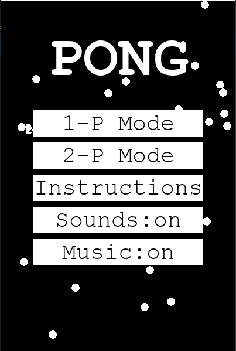
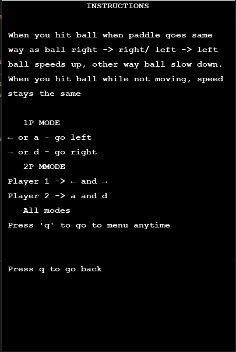
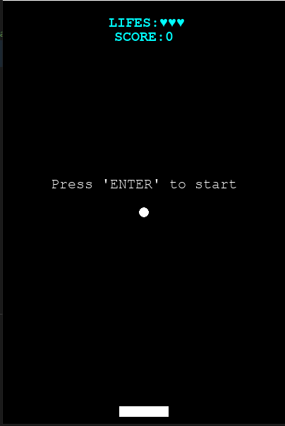
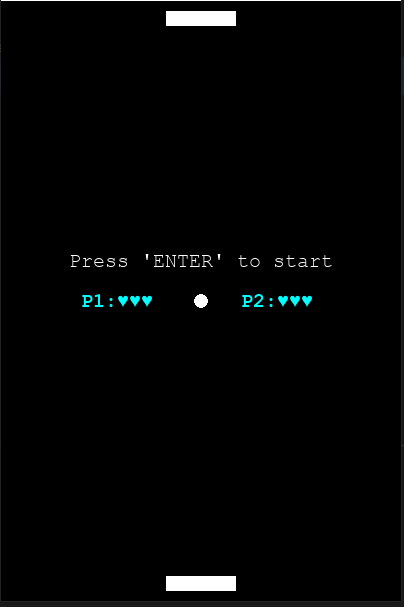

Introduction
============
PONG is my first game created with pygame library without using any tutorial, just reading manual so it's kinda messy, chaotic and buggy.
This project was growing like a snow ball as fast as I have discovered another pygame features.
That's why some parts of code could be rewritten or be written smartier what I will note in next project.

Game mechanics
-------------
This game is inspired by old retro game pong, but reinvented by my ideas and my low pygame skills.
The main point is that there is a bouncy ball that you have to hit with paddle beacuse when you miss it you lose a life.
There are:
* One player mode where you move paddle to left or right and just hit the ball, each hit is 1 point to your score and
you have three chances to miss the ball.
* Two player mode on the same rules as 1-P mode but there is no score, just winner and loser.

Next to do
----------
* Highscore table, stored in a file
* Gamemode with powerups, like paddle size up/down,another ball spawn
* Added visual options in menu like possibility to change ball colour or skin

Screenshots
===========

Technologies
===========
* Python 3.8.3
* pygame 2.0.1
